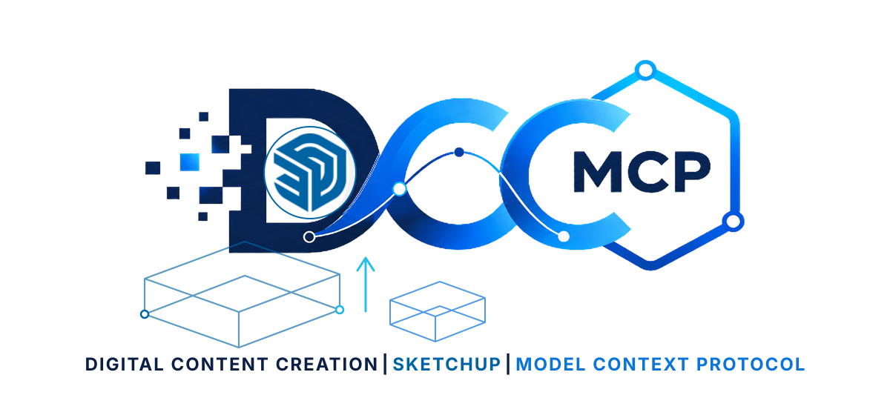
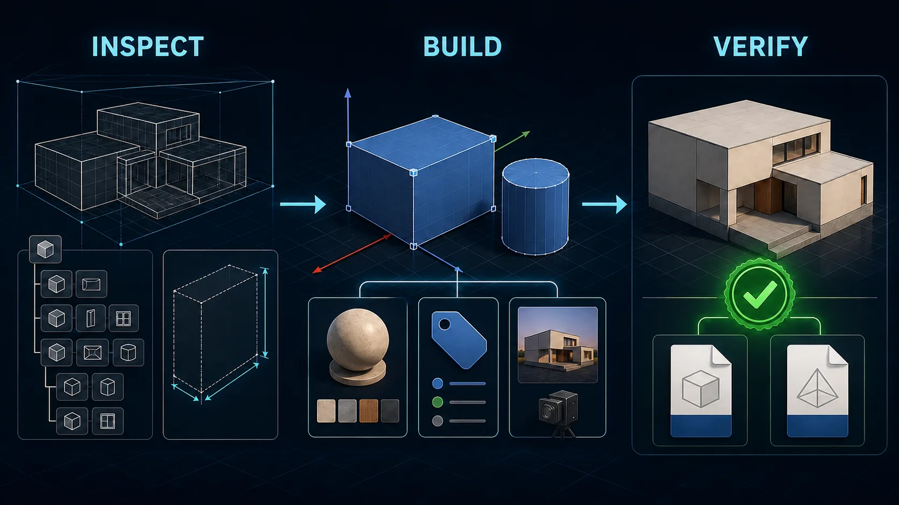

# dcc-mcp-sketchup

<p align="center">
  <picture>
    <source media="(prefers-color-scheme: dark)" srcset="docs/assets/dcc-mcp-sketchup-dark.svg">
    <source media="(prefers-color-scheme: light)" srcset="docs/assets/dcc-mcp-sketchup.svg">
    
  </picture>
</p>

Production SketchUp adapter for the [DCC-MCP](https://github.com/dcc-mcp) ecosystem.
It combines a small Ruby extension inside SketchUp with an external Python
sidecar, exposing 28 typed tools without arbitrary Ruby execution.



<sub>Workflow illustration generated with OpenAI image generation; no third-party source assets.</sub>

## Capabilities

- Inspect model identity, bounds, entities, selection, and validation state.
- Save or copy `.skp` models and use installed SketchUp importers/exporters.
- Create boxes and cylinders, group, transform, rename, select, and erase entities.
- List, create, edit, assign, and safely remove materials.
- Manage saved scenes and Tags.
- Reference entities through SketchUp persistent IDs.
- Package four discoverable DCC-MCP Skills with complete JSON Schemas and MCP annotations.

## Architecture

```text
DCC-MCP client
      |
      v
external Python sidecar (dcc-mcp-core)
      |
      | authenticated, bounded JSON-RPC on 127.0.0.1
      v
UI.start_timer callback on SketchUp's UI thread
      |
      | nonblocking, bounded socket pump + one-request queue
      |
      v
typed SketchUp Ruby API command map
```

The Ruby extension has a single socket owner: the repeating UI timer. Each tick
uses zero-timeout `IO.select` and nonblocking accept, read, and write operations
across at most 16 connections, then executes at most one validated request.
Frame, response, connection, and deadline limits keep every tick bounded while
preserving SketchUp's thread affinity. No worker thread performs socket I/O or
calls the SketchUp API. Every model mutation is a named undoable operation.

## Requirements

- SketchUp Desktop 2021 or newer on Windows or macOS.
- Python 3.9 or newer for the external sidecar.
- `dcc-mcp-core>=0.19.91,<1.0.0` (installed automatically).

Importer and exporter availability varies by SketchUp edition, version, and
installed extensions. The adapter reports the host error instead of claiming a
format is available when SketchUp rejects it.

## Install

Install the package into the Python environment used by DCC-MCP:

```bash
python -m pip install dcc-mcp-sketchup
```

Start SketchUp once so its versioned user profile exists, then install the Ruby
extension:

```bash
dcc-mcp-sketchup install
```

For a specific SketchUp profile, pass its Plugins directory explicitly:

```bash
dcc-mcp-sketchup install \
  --plugins-dir "C:/Users/you/AppData/Roaming/SketchUp/SketchUp 2026/SketchUp/Plugins"
```

Restart SketchUp. The extension binds an ephemeral loopback port, generates a
random token, and launches the host-bound sidecar automatically. It terminates
the sidecar when SketchUp exits.

To update or remove only files owned by this package:

```bash
dcc-mcp-sketchup install --overwrite
dcc-mcp-sketchup uninstall
```

## Skills and tools

| Skill | Tools |
| --- | --- |
| `sketchup-session` | status, inspection, root entities, save, copy, validate, import, export |
| `sketchup-modeling` | box, cylinder, group, transform, rename, erase, select |
| `sketchup-materials` | list, create, update, assign, remove |
| `sketchup-scenes` | list/create/update/remove scenes and Tags |

File paths must be absolute. Existing export and copy targets are refused unless
`overwrite=true`. Removing a material or Tag is refused while model content uses
it. The default Untagged Tag is never removable.

## Development and verification

```bash
python -m pip install -e ".[dev]"
python -m pytest
python -m ruff check src tests
python -m ruff format --check src tests
python -m build
python -m twine check dist/*
ruby tests/ruby/test_commands.rb
```

CI covers Python 3.9 through 3.12 on Windows, macOS, and Linux, plus Ruby
syntax and command-contract tests. A production release additionally requires a
real SketchUp Desktop smoke test and a fresh installation from public PyPI.

## Security boundary

- Loopback-only listener on an operating-system-assigned port.
- Random per-session bearer token with constant-time comparison.
- Correlated request IDs, deadlines, 1 MiB request/response limits, and a bounded queue.
- Fixed typed command allowlist; no `eval`, arbitrary Ruby, shell, or generic property access.
- Sidecar is bound to one SketchUp PID and stops when that host exits.
- Installer owns only `dcc_mcp_sketchup.rb` and the `dcc_mcp_sketchup/` directory.

## References

- [SketchUp Ruby API](https://ruby.sketchup.com/)
- [SketchUp extension registration tutorial](https://developer.sketchup.com/tut-hello-cube-rb)
- [SketchUp model API](https://ruby.sketchup.com/Sketchup/Model.html)
- [SketchUp UI timer API](https://ruby.sketchup.com/UI)

## License

MIT. SketchUp and its marks are property of Trimble Inc.; this project is an
independent integration and is not affiliated with or endorsed by Trimble.
