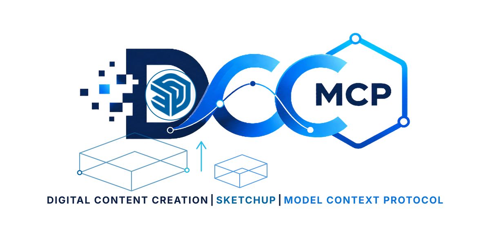
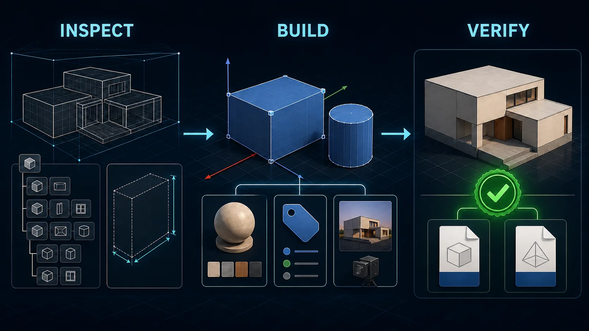

# dcc-mcp-sketchup

<p align="center">
  <picture>
    <source media="(prefers-color-scheme: dark)" srcset="docs/assets/dcc-mcp-sketchup-dark.svg">
    <source media="(prefers-color-scheme: light)" srcset="docs/assets/dcc-mcp-sketchup.svg">
    
  </picture>
</p>

Production SketchUp adapter for the [DCC-MCP](https://github.com/dcc-mcp) ecosystem.
It combines a small Ruby extension inside SketchUp with an external Python
sidecar, exposing 28 typed tools without arbitrary Ruby execution.



<sub>Workflow illustration generated with OpenAI image generation; no third-party source assets.</sub>

<!-- dcc-mcp-coverage-pointer:start -->
<!-- Generated from dcc-mcp-catalog.yml by scripts/generate_adapter_pointer.py in dcc-mcp/dcc-mcp-core. Do not edit by hand. -->
## Part of the DCC-MCP host matrix

**dcc-mcp-sketchup** — SketchUp adapter with typed modeling, materials, scenes,
validation, and interchange workflows.

It is one of **47 host adapters** in the DCC-MCP catalog. Every adapter speaks the same
MCP protocol and builds on the same core runtime contract; each one exposes the tools
its own host needs on top of that.

- [All host adapters and install metadata](https://dcc-mcp.github.io/ecosystem)
- [Host matrix on the core README](https://github.com/dcc-mcp/dcc-mcp-core#readme)
- [Showcase](https://dcc-mcp.github.io/showcase)

This block is generated from the catalog entry in
[`dcc-mcp-catalog.yml`](https://github.com/dcc-mcp/dcc-mcp-core/blob/main/dcc-mcp-catalog.yml).
Re-run the generator after changing the catalog.
<!-- dcc-mcp-coverage-pointer:end -->

## Capabilities

- Inspect model identity, bounds, entities, selection, and validation state.
- Save or copy `.skp` models and use installed SketchUp importers/exporters.
- Create boxes and cylinders, group, transform, rename, select, and erase entities.
- List, create, edit, assign, and safely remove materials.
- Manage saved scenes and Tags.
- Reference entities through SketchUp persistent IDs.
- Package four discoverable DCC-MCP Skills with complete JSON Schemas and MCP annotations.

## Architecture

```text
DCC-MCP client
      |
      v
external Python sidecar (dcc-mcp-core)
      |
      | authenticated, bounded JSON-RPC on 127.0.0.1
      v
UI.start_timer callback on SketchUp's UI thread
      |
      | nonblocking, bounded socket pump + one-request queue
      |
      v
typed SketchUp Ruby API command map
```

The Ruby extension has a single socket owner: the repeating UI timer. Each tick
uses zero-timeout `IO.select` and nonblocking accept, read, and write operations
across at most 16 connections, then executes at most one validated request.
Frame, response, connection, and deadline limits keep every tick bounded while
preserving SketchUp's thread affinity. No worker thread performs socket I/O or
calls the SketchUp API. Every model mutation is a named undoable operation.

## Two runtimes: host-side Python, in-SketchUp Ruby

This adapter is two programs, not one. Knowing which side owns what explains
most of its behaviour.

| | Host-side Python sidecar | In-SketchUp Ruby extension |
| --- | --- | --- |
| Runs in | A separate Python process, one per SketchUp PID | The SketchUp process, on the UI thread |
| Owns | MCP surface, skill schemas, install lifecycle, compatibility matrix | The model: every read and every mutation |
| Talks | Authenticated JSON-RPC over loopback, newline-delimited | Same socket, pumped by a `UI.start_timer` callback |
| Can see | Nothing about the model until the host answers | The whole model, and only on the UI thread |

**Discovery order.** SketchUp launches the sidecar, not the other way round.
The extension binds an ephemeral loopback port, generates a random per-session
token, writes `DCC_MCP_SKETCHUP_BRIDGE_PORT` / `_TOKEN` into the child
environment, and spawns the sidecar. The sidecar then polls `bridge.health`
until SketchUp answers, and exits when the host PID disappears. So a running
Python process alone proves nothing; readiness is only ever established by the
host answering across that socket.

**Bridge protocol.** One JSON-RPC request per connection, at most 16
connections, one request in flight on the UI thread. Requests carry a 32-hex
request id and a deadline; responses are correlated by id and compared in
constant time. `bridge.health` is a virtual method that the Ruby runtime routes
to `diagnostics.ping`.

**Python cannot verify anything on its own.** It cannot read the model, so a
mutation is only proven once the Ruby side has read the target back. See
[Write verification](#write-verification-across-the-ruby-boundary).

## Requirements

- SketchUp Desktop 2021 or newer on Windows or macOS.
- Python 3.9 or newer for the external sidecar.
- `dcc-mcp-core>=0.20.36,<1.0.0` (installed automatically).

Importer and exporter availability varies by SketchUp edition, version, and
installed extensions. The adapter reports the host error instead of claiming a
format is available when SketchUp rejects it.

## Install

See the [Install and lifecycle runbook](install.md) for the agent-first JSON contract, supported
host versions, verification, transactional upgrade, receipt-driven uninstall, and troubleshooting.

Install the package into the Python environment used by DCC-MCP:

```bash
python -m pip install dcc-mcp-sketchup
```

Start SketchUp once so its versioned user profile exists, inspect the JSON plan,
then install the Ruby extension:

```bash
dcc-mcp-sketchup install --dcc-path "C:/Program Files/SketchUp/SketchUp 2026/SketchUp.exe" --json --dry-run
dcc-mcp-sketchup install --dcc-path "C:/Program Files/SketchUp/SketchUp 2026/SketchUp.exe" --json --yes
```

Use `--python` when the sidecar belongs to another Python environment. The
installer selects the versioned profile matching `--dcc-path`, writes a receipt,
and verifies files, importability, bootstrap state, and the live host probe.

Open or restart SketchUp after installation. The extension binds an ephemeral
loopback port, generates a random token, and launches the host-bound sidecar
automatically. It terminates the sidecar when SketchUp exits.

To update or remove only files owned by this package:

```bash
dcc-mcp-sketchup upgrade --dcc-path "C:/Program Files/SketchUp/SketchUp 2026/SketchUp.exe" --json --yes
dcc-mcp-sketchup uninstall --dcc-path "C:/Program Files/SketchUp/SketchUp 2026/SketchUp.exe" --json --yes
```

## Skills and tools

| Skill | Tools |
| --- | --- |
| `sketchup-session` | status, inspection, root entities, save, copy, validate, import, export |
| `sketchup-modeling` | box, cylinder, group, transform, rename, erase, select |
| `sketchup-materials` | list, create, update, assign, remove |
| `sketchup-scenes` | list/create/update/remove scenes and Tags |

File paths must be absolute. Existing export and copy targets are refused unless
`overwrite=true`. Removing a material or Tag is refused while model content uses
it. The default Untagged Tag is never removable.

## Host support (doctor)

Supported SketchUp versions are declared in one machine-readable file,
`src/dcc_mcp_sketchup/compat_matrix.json`, which ships inside the wheel. It is
the single source of truth: the `doctor`, the installer's `verify`, and the Ruby
API probe all read it. A version outside the declared ranges is rejected with an
explicit error code instead of being assumed compatible.

`doctor` reports what it can actually observe, and says so when it cannot:

```bash
dcc-mcp-sketchup doctor --json
```

| Report field | Meaning |
| --- | --- |
| `checks.installed_host` | A SketchUp executable and matching versioned profile exist on this machine |
| `checks.live_host` | A SketchUp process answered `bridge.health`; `sketchup_version` and `ruby_version` are observed, not inferred |
| `checks.host_matrix` | The version classified against the matrix, plus `source` (`live_host` or `installed_host`) |
| `checks.api_surface` | Which required Ruby API symbols the live host actually exposes |
| `verify.directly_usable` | True only when every check passed, which requires a **live** host |

Exit codes follow the install lifecycle: `0` usable, `10` preflight, `40`
verify. Installed-but-not-running SketchUp exits `40` with
`error_code` `sketchup_host_not_running` — an executable on disk is not evidence
that the adapter works.

SketchUp reports its version either as a product year (`2026.0`) or as a build
line (`26.0.575`). Both name the same application, so `doctor` folds both onto
the product year before classifying.

### Write verification across the Ruby boundary

Every mutating tool proves its change took effect before it reports success. The
read-back runs **on the Ruby side**, because Python cannot see the model, and is
enforced **on the Python side**, because a read-back only Ruby knows about is
not a contract:

1. Ruby performs the mutation inside a named undoable operation, then re-reads
   the target through its persistent id and records `expected` / `actual` pairs.
2. A disagreement is raised before the operation commits, so the mutation is
   rolled back rather than left half-applied. The error carries the tool, the
   check, both values, and the host version.
3. Ruby returns a `verification` block with the checks that passed.
4. Python rejects any mutating result that does not carry a verified block, so a
   Ruby side that stopped verifying, or a response that never crossed the wire,
   fails instead of being read as success.

Adding a command to the Ruby map without deciding whether it owes a read-back
fails the test suite. That classification lives in
`src/dcc_mcp_sketchup/write_contract.py`.

## Development and verification

```bash
python -m pip install -e ".[dev]"
python -m pytest
python -m ruff check src tests
python -m ruff format --check src tests
python -m build
python -m twine check dist/*
ruby -e 'Dir["tests/ruby/test_*.rb"].sort.each { |file| require File.expand_path(file) }'
```

CI covers Python 3.9 through 3.12 on Windows, macOS, and Linux, plus a Ruby job
running syntax checks and contract tests. A production release additionally
requires a real SketchUp Desktop smoke test and a fresh installation from public
PyPI.

### What the Ruby job does and does not prove

The Ruby job runs against `tests/ruby/sketchup_fakes.rb`, an in-memory stub of
the SketchUp API. It is **contract-level evidence, not host-level evidence**:

- It proves the command layer honours its contract: parameter validation, typed
  coercion, one undo operation per mutation, and a read-back that disagrees
  loudly when the model does not match the request.
- It does **not** prove that a real SketchUp executed the commands, or that the
  SketchUp Ruby API on a given product year behaves as the stubs do.

SketchUp is a licensed desktop application that cannot be installed on a hosted
runner, so no host-level end-to-end run exists in CI. Every entry in
`compat_matrix.json` records that bound, and the doctor echoes it. Contract
green is not host green, and nothing in this repository treats it as such.

## Security boundary

- Loopback-only listener on an operating-system-assigned port.
- Random per-session bearer token with constant-time comparison.
- Correlated request IDs, deadlines, 1 MiB request/response limits, and a bounded queue.
- Fixed typed command allowlist; no `eval`, arbitrary Ruby, shell, or generic property access.
- Sidecar is bound to one SketchUp PID and stops when that host exits.
- Installer owns only `dcc_mcp_sketchup.rb` and the `dcc_mcp_sketchup/` directory.

## References

- [SketchUp Ruby API](https://ruby.sketchup.com/)
- [SketchUp extension registration tutorial](https://developer.sketchup.com/tut-hello-cube-rb)
- [SketchUp model API](https://ruby.sketchup.com/Sketchup/Model.html)
- [SketchUp UI timer API](https://ruby.sketchup.com/UI)

## License

MIT. SketchUp and its marks are property of Trimble Inc.; this project is an
independent integration and is not affiliated with or endorsed by Trimble.
